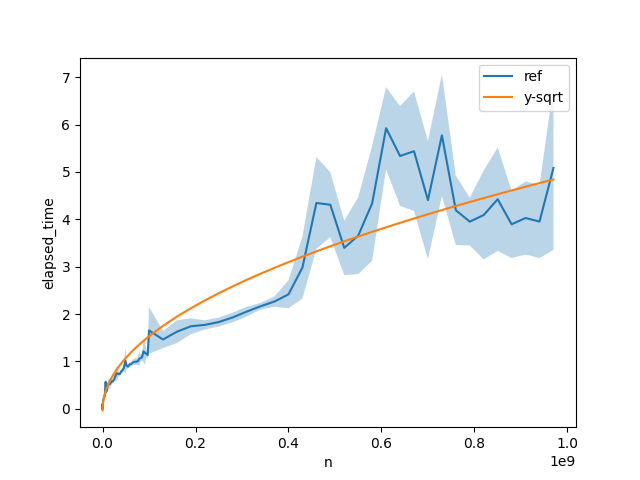

# Big-O estimator

Big-O estimator helps to understand "exact" algorithm performance you implemented.

NOTE: Currently under early developments.

## Features

* Benchmarking:
    * [X] Python function
    * [ ] Other Programing language (`C++`, ...)
* [X] Visualization
* Estimator:
    * [X] Baseline (Bruto-force search with linear regression)
    * [ ] More efficient estimator
* Support multiplications of:
    * [X] Exponentiation ($n^k$, k \in [1/2, 1, 3/2, ..., ])
    * [X] Logarithm (Log n)
    * [ ] ...

## Toy demonstration

Here is a toy demonstration ([code](tests/test.py)).

We benchmarked divisors algorithm (ideally `O(sqrt(N)`). To estimate "real" computation complexity, we compared mean-squared-error between only `O(N)`, `O(sqrt(N))` and `O(log(N))` regressor learned from benchmarking data. 

As a result, it estimated that the most appropriate computational complexity is `O(sqrt(N))`.

The fitting curve looks like as follows:

